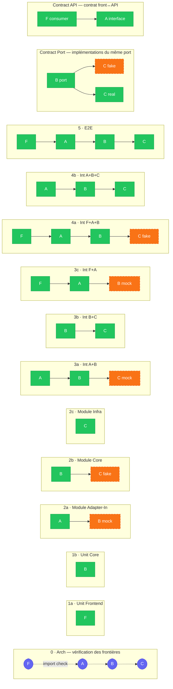

# Test Mapping — Hexagonal Architecture

## Modules

| Symbol | Nom | Cardinalité |
|--------|-----|-------------|
| **F** | Frontend | 1 |
| **A** | Entry adapter (API, CLI, connector) | 1 par point d'entrée |
| **B** | Application + Core (domain + use cases) | 1 seul |
| **C** | Infra adapters (implémentent les outbound ports) | N ports × M implémentations |

---

## Cartographie des tests

### Niveau 0 — Tests d'architecture

| | |
|---|---|
| **Scope** | Toute la codebase (méta-test) |
| **Noms proposés** | `arch`, `arch-guard`, `boundary-check`, `hex-lint` |
| **Description** | Vérifie que les règles d'import entre couches sont respectées : B n'importe pas C, A n'importe pas C, etc. Échoue à la CI si une frontière est violée. |
| **Avantages** | Très rapide, protège l'architecture sans effort humain, visible dans la CI |
| **Inconvénients** | Ne teste pas le comportement, outillage peu répandu en JS (dependency-cruiser) |

---

### Niveau 1 — Tests unitaires (1 module, code interne)

#### 1a. Unit — Core (B)

| | |
|---|---|
| **Scope** | B interne (entités, value objects, services de domaine) |
| **Noms proposés** | `unit-core`, `domain-unit`, `core-unit`, `biz-unit` |
| **Description** | Teste les règles métier, edge cases et calculs au niveau des méthodes. Aucune dépendance technique. |
| **Avantages** | Ultra-rapide, déterministe, testable en property-based testing, feedback immédiat |
| **Inconvénients** | Ne valide pas les interactions entre composants |

#### 1b. Unit — Frontend (F)

| | |
|---|---|
| **Scope** | F interne (composants, hooks, utils) |
| **Noms proposés** | `unit-ui`, `ui-unit`, `front-unit`, `component-unit` |
| **Description** | Teste la logique interne des composants React, hooks, et fonctions utilitaires. |
| **Avantages** | Rapide, isole les bugs de rendu et de logique UI |
| **Inconvénients** | Ne valide pas l'intégration avec l'API réelle |

---

### Niveau 2 — Tests de module (1 module, via son interface)

#### 2a. Module — Adapter d'entrée (A)

| | |
|---|---|
| **Scope** | A complet, B mocké |
| **Noms proposés** | `adapter-in`, `api-module`, `entry-module`, `transport-test` |
| **Description** | Teste la sérialisation JSON, la validation des DTOs, les codes HTTP (200/400/404/500) et le routing. B est simulé via mock/stub. |
| **Avantages** | Vérifie le contrat HTTP sans logique métier, rapide |
| **Inconvénients** | Ne valide pas les vraies règles métier |

#### 2b. Module — Core avec doubles (B)

| | |
|---|---|
| **Scope** | B complet via ses interfaces, C remplacé par des fakes in-memory |
| **Noms proposés** | `core-module`, `app-module`, `use-case`, `biz-module` |
| **Description** | Instancie le core complet et injecte des fakes in-memory à la place des adapters infra. Valide 100 % du workflow métier. Idéal pour BDD/Cucumber. |
| **Avantages** | Ultra-rapide, couvre tout le domaine, pas de base de données |
| **Inconvénients** | Les fakes peuvent diverger de l'implémentation réelle |

#### 2c. Module — Adapter de sortie / Infra (C)

| | |
|---|---|
| **Scope** | Chaque adapter C individuellement, systèmes externes réels |
| **Noms proposés** | `infra-module`, `adapter-out`, `repo-test`, `driven-adapter` |
| **Description** | Teste les requêtes SQL, la configuration des clients HTTP tiers et le mapping entités↔BD. Utilise des conteneurs éphémères (Testcontainers). Comparaison entre les différentes implémentations d'un même port pour valider l'interchangeabilité. |
| **Avantages** | Confiance réelle sur la couche données, valide la syntaxe SQL |
| **Inconvénients** | Lent, coûteux (containers), difficile à paralléliser |

---

### Niveau 3 — Tests d'intégration à 2 modules

#### 3a. Adapter + Core (A + B)

| | |
|---|---|
| **Scope** | A + B, C mocké |
| **Noms proposés** | `int-api-core`, `entry-core`, `api-biz`, `adapter-core` |
| **Description** | Teste l'intégration entre le point d'entrée et le core. Les ports d'infra sont mockés. Vérifie que le routing, la validation et les use cases s'enchaînent correctement. |
| **Avantages** | Couvre deux couches sans base de données, encore assez rapide |
| **Inconvénients** | Les mocks de C peuvent masquer des incompatibilités réelles |

#### 3b. Core + Infra (B + C)

| | |
|---|---|
| **Scope** | B + C, pas de mock |
| **Noms proposés** | `int-core-infra`, `core-infra`, `biz-db`, `app-infra` |
| **Description** | Teste le core avec les vraies implémentations infra (base de données réelle). Valide que les use cases fonctionnent de bout en bout côté backend. |
| **Avantages** | Haute confiance sur la logique + persistance |
| **Inconvénients** | Lent, nécessite une base de données, exclure de la CI par défaut |

#### 3c. Frontend + Adapter (F + A, B mocké)

| | |
|---|---|
| **Scope** | F + A, B mocké |
| **Noms proposés** | `int-front-api`, `ui-api`, `front-adapter`, `front-transport` |
| **Description** | Teste l'intégration entre le frontend et l'API (sérialisation, gestion d'erreurs HTTP, navigation). L'application core est simulée. |
| **Avantages** | Isole les problèmes de contrat front↔API |
| **Inconvénients** | Ne valide pas la logique métier |

---

### Niveau 4 — Tests d'intégration à 3 modules

#### 4a. Frontend + Adapter + Core (F + A + B, C mocké)

| | |
|---|---|
| **Scope** | F + A + B, C remplacé par fakes |
| **Noms proposés** | `int-front-core`, `ui-biz`, `front-app`, `e2e-no-db` |
| **Description** | Teste le workflow complet côté interface utilisateur jusqu'aux use cases, sans base de données réelle. Permet de valider des scénarios fonctionnels en isolation. |
| **Avantages** | Couvre l'expérience utilisateur complète sans coût infra |
| **Inconvénients** | Les fakes C peuvent diverger de la réalité |

#### 4b. Adapter + Core + Infra (A + B + C, pas de mock)

| | |
|---|---|
| **Scope** | A + B + C, pas de mock |
| **Noms proposés** | `int-api-full`, `backend-e2e`, `full-backend`, `api-infra` |
| **Description** | Teste l'intégration complète du backend (REST → use case → base de données). Valide les chemins critiques sans interface graphique. |
| **Avantages** | Confiance maximale côté backend |
| **Inconvénients** | Lent, nécessite l'infra complète |

---

### Niveau 5 — Tests E2E (4 modules)

#### 5a. End-to-End complet (F + A + B + C)

| | |
|---|---|
| **Scope** | F + A + B + C, aucun mock |
| **Noms proposés** | `e2e`, `ui-e2e`, `system`, `full-e2e` |
| **Description** | Démarre l'application entière (idéalement en container), envoie de vraies interactions UI (Playwright, Cypress) et laisse l'application interagir avec une base de données de test réelle. Limité aux happy paths critiques. |
| **Avantages** | Confiance maximale, valide le système tel que l'utilisateur le vit |
| **Inconvénients** | Très lent, fragile, coûteux à maintenir, exclure de la CI standard |

---

### Complémentaire — Tests de contrat

#### C1. Contrat interne (port infra)

| | |
|---|---|
| **Scope** | Interface d'un port (B↔C) |
| **Noms proposés** | `port-contract`, `infra-contract`, `port-parity`, `impl-parity` |
| **Description** | Suite de tests écrite pour l'interface du port, jouée contre chaque implémentation (fake in-memory + adapters réels). Garantit que toutes les implémentations sont interchangeables. |
| **Avantages** | Valide l'interchangeabilité des adapters, détecte les divergences fake/réel |
| **Inconvénients** | Effort d'écriture initial, nécessite une discipline pour maintenir la suite abstraite |

#### C2. Contrat externe (API)

| | |
|---|---|
| **Scope** | Interface de A vue par F ou un service tiers |
| **Noms proposés** | `api-contract`, `consumer-contract`, `pact-test`, `api-compat` |
| **Description** | Vérifie que les changements d'API ne cassent pas les consommateurs (frontend ou microservices). Outillage type : Pact. |
| **Avantages** | Détecte les breaking changes avant la mise en production |
| **Inconvénients** | Nécessite une coordination entre équipes, outillage supplémentaire (Pact broker) |

---

## Vue synthétique — Pyramide

```
         [E2E]          F+A+B+C       Niveau 5 — 1 à 2 tests max
        /       \
   [Int L3]    [Int L3]  A+B+C / F+A+B  Niveau 4
   /     \     /    \
[Int L2] [Int L2] [Int L2]  A+B / B+C / F+A  Niveau 3
  |        |        |
[Mod A] [Mod B] [Mod C]   Modules isolés  Niveau 2
  |        |        |
[Unit F]  [Unit B]         Unitaires      Niveau 1
              |
         [Arch]            Architecture   Niveau 0
```

| Niveau | Scope | Vitesse | Confiance | CI |
|--------|-------|---------|-----------|-----|
| Arch | méta | ⚡⚡⚡ | frontières | ✅ |
| Unit | 1 module interne | ⚡⚡⚡ | logique pure | ✅ |
| Module | 1 module via interface | ⚡⚡ | module complet | ✅ |
| Int L2 | 2 modules | ⚡ | intégration partielle | ✅ (si pas DB) |
| Int L3 | 3 modules | 🐢 | quasi-système | ⚠️ optionnel |
| E2E | 4 modules | 🐢🐢 | système complet | ❌ exclu |
| Contrat | interface | ⚡⚡ | compatibilité | ✅ |

---

## Diagramme — Scope par test

**Légende :** `[X]` module réel · `[X mock]` module simulé/fake · absent = hors scope


