# Dépendances Applications → Ports

## AppSettingsService

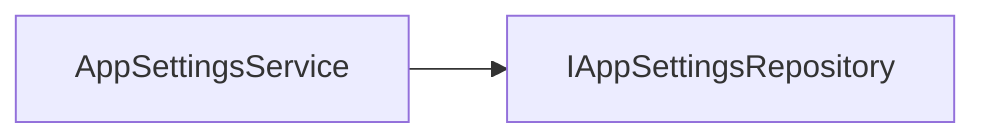

## AskQuestion

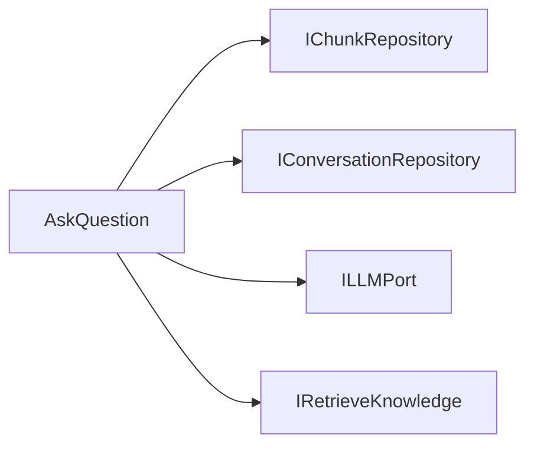

## CheckStorageConsistency

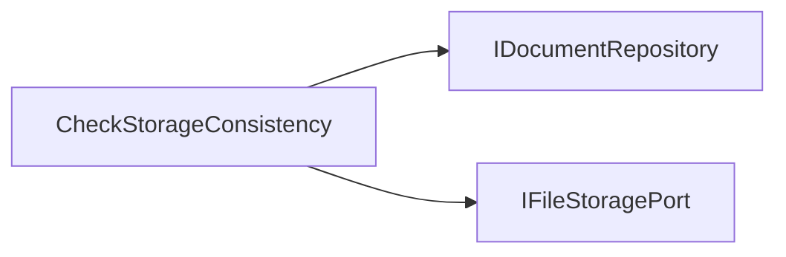

## ConversationTitleGenerator

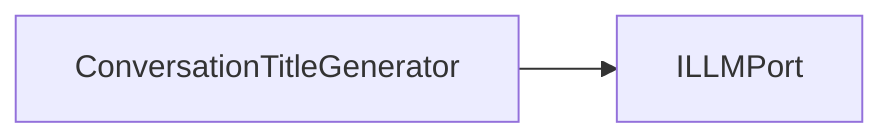

## CreateDocument

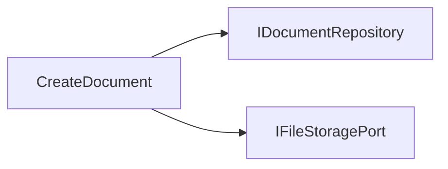

## GenerateQuiz

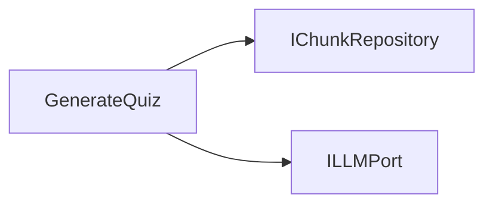

## IngestDocument

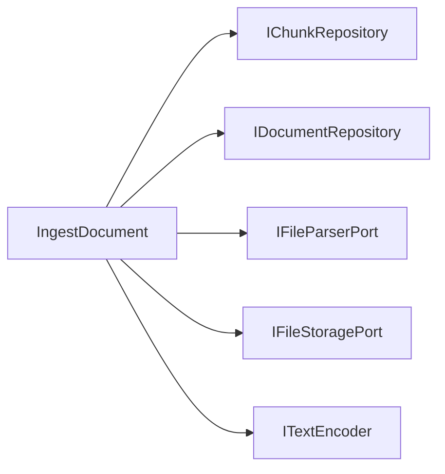

## ResetAll

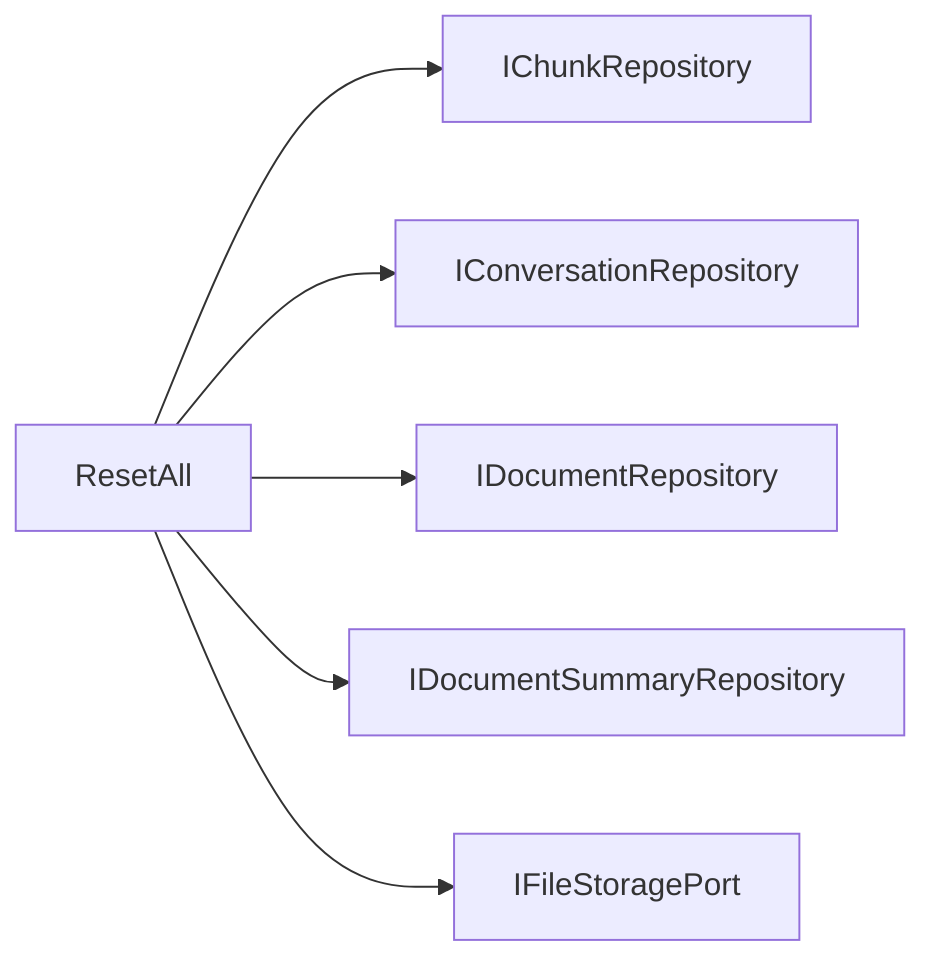

## RetrieveKnowledge

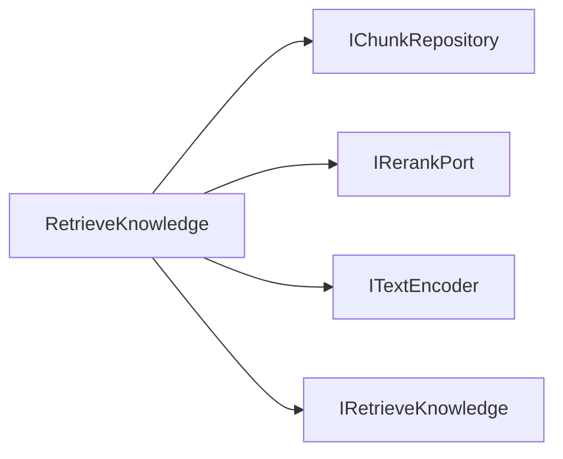

## SourceCitationResolver

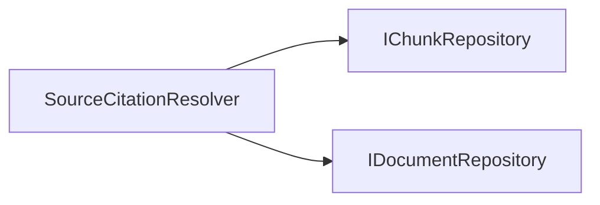

## SummarizeDocument

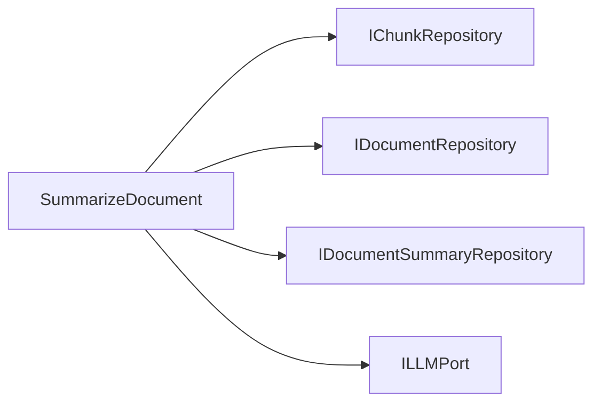
