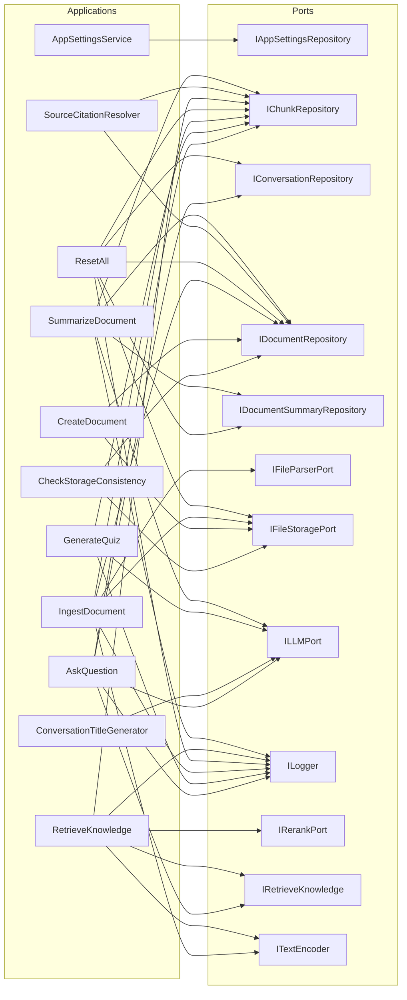

# Dépendances Applications → Ports

```mermaid
graph LR
  subgraph Applications
    AppSettingsService
    AskQuestion
    CheckStorageConsistency
    ConversationTitleGenerator
    CreateDocument
    GenerateQuiz
    IngestDocument
    ResetAll
    RetrieveKnowledge
    SourceCitationResolver
    SummarizeDocument
  end

  subgraph Ports
    IAppSettingsRepository
    IChunkRepository
    IConversationRepository
    IDocumentRepository
    IDocumentSummaryRepository
    IFileParserPort
    IFileStoragePort
    ILLMPort
    ILogger
    IRerankPort
    IRetrieveKnowledge
    ITextEncoder
  end

  AppSettingsService --> IAppSettingsRepository

  AskQuestion --> IChunkRepository
  AskQuestion --> IConversationRepository
  AskQuestion --> ILLMPort
  AskQuestion --> ILogger
  AskQuestion --> IRetrieveKnowledge

  CheckStorageConsistency --> IDocumentRepository
  CheckStorageConsistency --> IFileStoragePort

  ConversationTitleGenerator --> ILLMPort

  CreateDocument --> IDocumentRepository
  CreateDocument --> IFileStoragePort

  GenerateQuiz --> IChunkRepository
  GenerateQuiz --> ILLMPort
  GenerateQuiz --> ILogger

  IngestDocument --> IChunkRepository
  IngestDocument --> IDocumentRepository
  IngestDocument --> IFileParserPort
  IngestDocument --> IFileStoragePort
  IngestDocument --> ILogger
  IngestDocument --> ITextEncoder

  ResetAll --> IChunkRepository
  ResetAll --> IConversationRepository
  ResetAll --> IDocumentRepository
  ResetAll --> IDocumentSummaryRepository
  ResetAll --> IFileStoragePort
  ResetAll --> ILogger

  RetrieveKnowledge --> IChunkRepository
  RetrieveKnowledge --> ILogger
  RetrieveKnowledge --> IRerankPort
  RetrieveKnowledge --> ITextEncoder
  RetrieveKnowledge --> IRetrieveKnowledge

  SourceCitationResolver --> IChunkRepository
  SourceCitationResolver --> IDocumentRepository

  SummarizeDocument --> IChunkRepository
  SummarizeDocument --> IDocumentRepository
  SummarizeDocument --> IDocumentSummaryRepository
  SummarizeDocument --> ILLMPort
  SummarizeDocument --> ILogger
```
